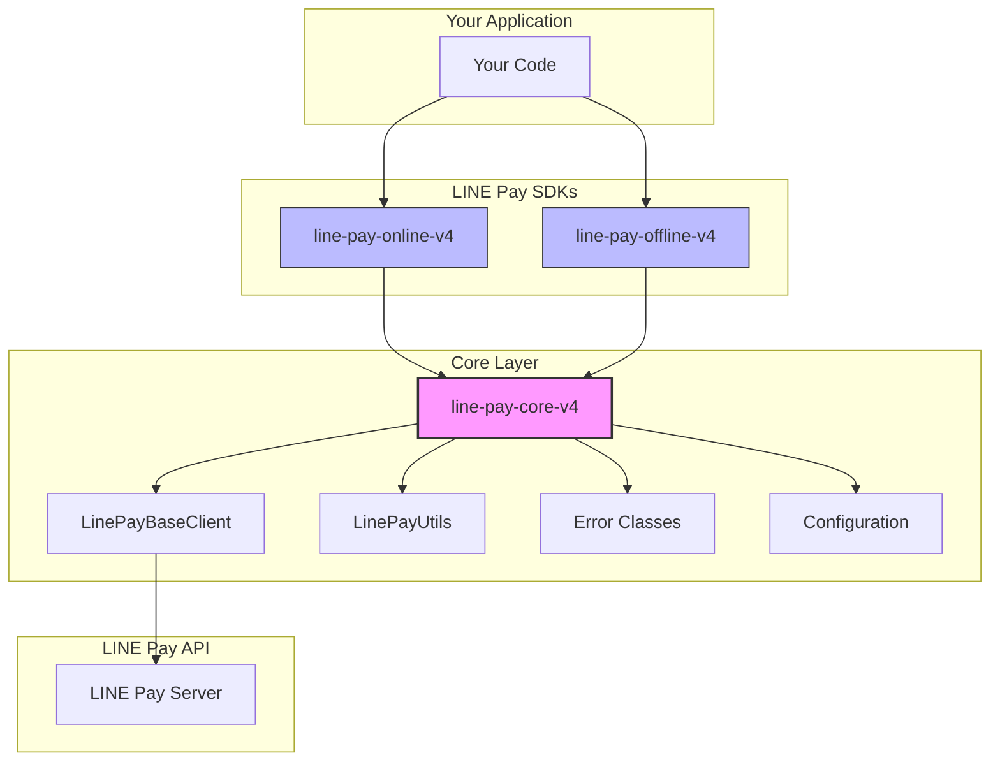

# LINE Pay Core V4 PHP

[](https://opensource.org/licenses/MIT)
[](https://www.php.net/)

**Core library for LINE Pay API V4 SDK.**
Provides shared utilities, base client, configuration, and error handling that power the Online and Offline SDKs.

**🌐 Language / 語言 / 言語 / ภาษา:**
[English](./README.md) | [繁體中文](./README_ZH.md) | [日本語](./README_JA.md) | [ภาษาไทย](./README_TH.md)

## Architecture



## Overview

This package is the **shared foundation** for building LINE Pay V4 integrations in PHP. It handles the "heavy lifting" so that the Online and Offline SDKs can focus on their specific API logic.

### Key Responsibilities

| Component | What It Does | Why It Matters |
|-----------|-------------|----------------|
| **HMAC-SHA256 Signature** | Generates and verifies API signatures | The most complex part of LINE Pay V4 API — one wrong byte and requests fail |
| **HTTP Client Wrapper** | Encapsulates Guzzle with retry logic | Handles timeouts, connection errors, and response parsing consistently |
| **Unified Error Parsing** | Parses LINE Pay error codes into typed exceptions | `1xxx` = Auth, `2xxx` = Payment, `9xxx` = Internal — no more guessing |
| **Configuration Management** | Type-safe config with environment support | Prevents "oops, wrong credentials in production" mistakes |

## Requirements

- PHP 8.1 or higher
- ext-json
- ext-openssl
- Guzzle HTTP Client 7.0+

## Installation

```bash
composer require carllee/line-pay-core-v4
```

> ⚠️ **Note:** This is a **core library** meant to be used as a dependency.
> 
> **Most developers should use the ready-made SDKs instead:**
> - For online payments (web/app checkout): [`carllee/line-pay-online-v4`](https://github.com/CarlLee1983/line-pay-online-v4-php)
> - For offline payments (POS/Kiosk): [`carllee/line-pay-offline-v4`](https://github.com/CarlLee1983/line-pay-offline-v4-php)
>
> **Use this package directly only if** you need to build a custom LINE Pay client with specialized behavior.

## Usage

### Creating a Custom Client

```php
use LinePay\Core\LinePayBaseClient;
use LinePay\Core\Config\LinePayConfig;

class MyLinePayClient extends LinePayBaseClient
{
    public function requestPayment(array $body): array
    {
        return $this->sendRequest('POST', '/v3/payments/request', $body);
    }

    public function confirmPayment(string $transactionId, array $body): array
    {
        return $this->sendRequest(
            'POST',
            "/v3/payments/{$transactionId}/confirm",
            $body
        );
    }
}

// Usage
$config = new LinePayConfig(
    channelId: getenv('LINE_PAY_CHANNEL_ID'),
    channelSecret: getenv('LINE_PAY_CHANNEL_SECRET'),
    env: 'sandbox', // or 'production'
    timeout: 30
);

$client = new MyLinePayClient($config);
```

### Utilities

```php
use LinePay\Core\LinePayUtils;

// Generate signature for API requests
$signature = LinePayUtils::generateSignature(
    $channelSecret,
    '/v3/payments/request',
    json_encode($requestBody),
    $nonce
);

// Validate transaction ID format (must be 19 digits)
if (LinePayUtils::isValidTransactionId($transactionId)) {
    // Process transaction
}

// Parse callback query parameters
$result = LinePayUtils::parseConfirmQuery($_GET);
// $result['transactionId'], $result['orderId']
```

### Security: Timing-Safe Signature Verification

The `verifySignature` method uses **constant-time comparison** to prevent timing attacks:

```php
use LinePay\Core\LinePayUtils;

// ✓ SECURE: Uses hash_equals() internally (timing-safe)
$isValid = LinePayUtils::verifySignature($secret, $data, $receivedSignature);

// ✗ INSECURE: Never do direct string comparison for signatures
// $isValid = ($expectedSignature === $receivedSignature); // Vulnerable to timing attacks!
```

**Why this matters:** A timing attack can determine how many characters of a signature match by measuring response time. Constant-time comparison always takes the same amount of time regardless of how many characters match.

### Error Handling

LINE Pay API error codes follow a pattern:

| Code Range | Category | Description |
|------------|----------|-------------|
| `1xxx` | Authentication | Channel ID/Secret issues, invalid signatures |
| `2xxx` | Payment | Transaction errors, insufficient balance, expired |
| `9xxx` | Internal | LINE Pay server errors, maintenance |

```php
use LinePay\Core\Errors\LinePayError;
use LinePay\Core\Errors\LinePayTimeoutError;
use LinePay\Core\Errors\LinePayConfigError;
use LinePay\Core\Errors\LinePayValidationError;

try {
    $response = $client->requestPayment($body);
} catch (LinePayTimeoutError $e) {
    // Handle timeout - IMPORTANT: Check payment status!
    echo "Request timed out after {$e->getTimeout()} seconds";
} catch (LinePayValidationError $e) {
    // Handle validation errors (before API call)
    echo "Invalid input: {$e->getMessage()}";
} catch (LinePayError $e) {
    // Handle API errors
    echo "Error [{$e->getReturnCode()}]: {$e->getReturnMessage()}";
    
    if ($e->isAuthError()) {
        // 1xxx: Check your Channel ID/Secret, or signature generation
        error_log("Auth failed - verify credentials");
    } elseif ($e->isPaymentError()) {
        // 2xxx: Transaction-specific issue (e.g., already refunded)
        notifyUser("Payment could not be processed");
    } elseif ($e->isInternalError()) {
        // 9xxx: LINE Pay server issue - retry with backoff
        scheduleRetry($body);
    }
} catch (LinePayConfigError $e) {
    // Configuration error (missing/invalid credentials)
    echo "Configuration error: {$e->getMessage()}";
}
```

## Configuration

| Parameter | Type | Required | Default | Description |
|-----------|------|----------|---------|-------------|
| `channelId` | string | Yes | - | Channel ID from LINE Pay Merchant Center |
| `channelSecret` | string | Yes | - | Channel Secret from LINE Pay Merchant Center |
| `env` | string | No | `'sandbox'` | Environment: `'production'` or `'sandbox'` |
| `timeout` | int | No | `20` | Request timeout in seconds |

## Related Packages

- [`carllee/line-pay-online-v4`](https://github.com/CarlLee1983/line-pay-online-v4) - LINE Pay Online API V4 client (web/app checkout)
- [`carllee/line-pay-offline-v4`](https://github.com/CarlLee1983/line-pay-offline-v4-php) - LINE Pay Offline API V4 client (POS/Kiosk)

## Development

```bash
# Install dependencies
composer install

# Run tests
composer test

# Run tests with coverage
composer test:coverage

# Run static analysis
composer analyze

# Fix code style
composer lint:fix
```

## License

MIT License - see the [LICENSE](LICENSE) file for details.

## Author

Carl Lee - [GitHub](https://github.com/CarlLee1983)
