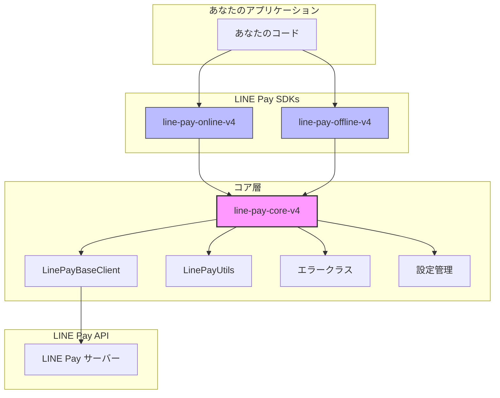

# LINE Pay Core V4 PHP

[](https://opensource.org/licenses/MIT)
[](https://www.php.net/)

**LINE Pay API V4 SDK コアライブラリ。**
Online と Offline SDK を支える共有ユーティリティ、ベースクライアント、設定、エラーハンドリングを提供します。

**🌐 Language / 語言 / 言語 / ภาษา:**
[English](./README.md) | [繁體中文](./README_ZH.md) | [日本語](./README_JA.md) | [ภาษาไทย](./README_TH.md)

## アーキテクチャ



## 概要

このパッケージは、PHP で LINE Pay V4 統合を構築するための**共有基盤**です。「面倒な処理」を担当し、Online と Offline SDK がそれぞれの API ロジックに集中できるようにします。

### コア責務

| コンポーネント | 機能 | 重要な理由 |
|---------------|------|-----------|
| **HMAC-SHA256 署名** | API 署名の生成と検証 | LINE Pay V4 API で最も複雑な部分 — 1バイト間違えるとリクエストが失敗 |
| **HTTP クライアントラッパー** | リトライロジック付きの Guzzle カプセル化 | タイムアウト、接続エラー、レスポンス解析を一貫して処理 |
| **統一エラー解析** | LINE Pay エラーコードを型付き例外に解析 | `1xxx` = 認証, `2xxx` = 決済, `9xxx` = 内部 — 推測不要 |
| **設定管理** | 環境変数対応のタイプセーフな設定 | 「本番環境で間違った認証情報を使った」ミスを防止 |

## 要件

- PHP 8.1 以上
- ext-json
- ext-openssl
- Guzzle HTTP Client 7.0+

## インストール

```bash
composer require carllee/line-pay-core-v4
```

> ⚠️ **注意:** これは依存パッケージとして使用される**コアライブラリ**です。
> 
> **ほとんどの開発者は、すぐに使える SDK を使用してください:**
> - オンライン決済（Web/App チェックアウト）: [`carllee/line-pay-online-v4`](https://github.com/CarlLee1983/line-pay-online-v4 )
> - オフライン決済（POS/Kiosk）: [`carllee/line-pay-offline-v4`](https://github.com/CarlLee1983/line-pay-offline-v4-php)
>
> **このパッケージを直接使用するのは**、特殊な動作を持つカスタム LINE Pay クライアントを構築する必要がある場合のみです。

## 使用方法

### カスタムクライアントの作成

```php
use LinePay\Core\LinePayBaseClient;
use LinePay\Core\Config\LinePayConfig;

class MyLinePayClient extends LinePayBaseClient
{
    public function requestPayment(array $body): array
    {
        return $this->sendRequest('POST', '/v3/payments/request', $body);
    }

    public function confirmPayment(string $transactionId, array $body): array
    {
        return $this->sendRequest(
            'POST',
            "/v3/payments/{$transactionId}/confirm",
            $body
        );
    }
}

// 使用法
$config = new LinePayConfig(
    channelId: getenv('LINE_PAY_CHANNEL_ID'),
    channelSecret: getenv('LINE_PAY_CHANNEL_SECRET'),
    env: 'sandbox', // または 'production'
    timeout: 30
);

$client = new MyLinePayClient($config);
```

### ユーティリティ

```php
use LinePay\Core\LinePayUtils;

// API リクエスト用の署名を生成
$signature = LinePayUtils::generateSignature(
    $channelSecret,
    '/v3/payments/request',
    json_encode($requestBody),
    $nonce
);

// トランザクション ID 形式の検証（19桁の数字である必要がある）
if (LinePayUtils::isValidTransactionId($transactionId)) {
    // トランザクションを処理
}

// コールバッククエリパラメータを解析
$result = LinePayUtils::parseConfirmQuery($_GET);
// $result['transactionId'], $result['orderId']
```

### セキュリティ: タイミングセーフな署名検証

`verifySignature` メソッドはタイミング攻撃を防ぐために**定時間比較**を使用します:

```php
use LinePay\Core\LinePayUtils;

// ✓ 安全: hash_equals() を内部で使用（タイミングセーフ）
$isValid = LinePayUtils::verifySignature($secret, $data, $receivedSignature);

// ✗ 危険: 署名の直接的な文字列比較は絶対にしない
// $isValid = ($expectedSignature === $receivedSignature); // タイミング攻撃に脆弱！
```

**なぜ重要か:** タイミング攻撃は、レスポンス時間を測定することで署名の何文字が一致しているかを特定できます。定時間比較は、一致する文字数に関係なく常に同じ時間がかかります。

### エラーハンドリング

LINE Pay API エラーコードはパターンに従います:

| コード範囲 | カテゴリ | 説明 |
|-----------|---------|------|
| `1xxx` | 認証 | Channel ID/Secret の問題、無効な署名 |
| `2xxx` | 決済 | トランザクションエラー、残高不足、期限切れ |
| `9xxx` | 内部 | LINE Pay サーバーエラー、メンテナンス |

```php
use LinePay\Core\Errors\LinePayError;
use LinePay\Core\Errors\LinePayTimeoutError;
use LinePay\Core\Errors\LinePayConfigError;
use LinePay\Core\Errors\LinePayValidationError;

try {
    $response = $client->requestPayment($body);
} catch (LinePayTimeoutError $e) {
    // タイムアウト処理 - 重要: 決済ステータスを確認！
    echo "リクエストが {$e->getTimeout()} 秒でタイムアウト";
} catch (LinePayValidationError $e) {
    // バリデーションエラー処理（API 呼び出し前）
    echo "無効な入力: {$e->getMessage()}";
} catch (LinePayError $e) {
    // API エラー処理
    echo "エラー [{$e->getReturnCode()}]: {$e->getReturnMessage()}";
    
    if ($e->isAuthError()) {
        // 1xxx: Channel ID/Secret または署名生成を確認
        error_log("認証失敗 - 認証情報を確認");
    } elseif ($e->isPaymentError()) {
        // 2xxx: トランザクション固有の問題（例: 既に返金済み）
        notifyUser("決済を処理できませんでした");
    } elseif ($e->isInternalError()) {
        // 9xxx: LINE Pay サーバーの問題 - バックオフでリトライ
        scheduleRetry($body);
    }
} catch (LinePayConfigError $e) {
    // 設定エラー（認証情報の欠落/無効）
    echo "設定エラー: {$e->getMessage()}";
}
```

## 設定

| パラメータ | 型 | 必須 | デフォルト | 説明 |
|-----------|------|------|---------|------|
| `channelId` | string | はい | - | LINE Pay 加盟店センターからの Channel ID |
| `channelSecret` | string | はい | - | LINE Pay 加盟店センターからの Channel Secret |
| `env` | string | いいえ | `'sandbox'` | 環境: `'production'` または `'sandbox'` |
| `timeout` | int | いいえ | `20` | リクエストタイムアウト秒数 |

## 関連パッケージ

- [`carllee/line-pay-online-v4`](https://github.com/CarlLee1983/line-pay-online-v4-php) - LINE Pay Online API V4 クライアント（Web/App チェックアウト）
- [`carllee/line-pay-offline-v4`](https://github.com/CarlLee1983/line-pay-offline-v4-php) - LINE Pay Offline API V4 クライアント（POS/Kiosk）

## 開発

```bash
# 依存関係をインストール
composer install

# テストを実行
composer test

# カバレッジ付きでテストを実行
composer test:coverage

# 静的解析を実行
composer analyze

# コードスタイルを修正
composer lint:fix
```

## ライセンス

MIT ライセンス - 詳細は [LICENSE](LICENSE) ファイルを参照。

## 作者

Carl Lee - [GitHub](https://github.com/CarlLee1983)
