# LINE Pay Core V4 PHP

[](https://opensource.org/licenses/MIT)
[](https://www.php.net/)

**Core library สำหรับ LINE Pay API V4 SDK**
มอบ utilities ที่ใช้ร่วมกัน, base client, การตั้งค่า และการจัดการข้อผิดพลาดที่ขับเคลื่อน Online และ Offline SDKs

**🌐 Language / 語言 / 言語 / ภาษา:**
[English](./README.md) | [繁體中文](./README_ZH.md) | [日本語](./README_JA.md) | [ภาษาไทย](./README_TH.md)

## สถาปัตยกรรม

```mermaid
graph TD
    subgraph "แอปพลิเคชันของคุณ"
        A[โค้ดของคุณ]
    end
    
    subgraph "LINE Pay SDKs"
        B[line-pay-online-v4]
        C[line-pay-offline-v4]
    end
    
    subgraph "Core Layer"
        D[line-pay-core-v4]
        D1[LinePayBaseClient]
        D2[LinePayUtils]
        D3[Error Classes]
        D4[Configuration]
    end
    
    subgraph "LINE Pay API"
        E[LINE Pay Server]
    end
    
    A --> B
    A --> C
    B --> D
    C --> D
    D --> D1
    D --> D2
    D --> D3
    D --> D4
    D1 --> E
    
    style D fill:#f9f,stroke:#333,stroke-width:2px
    style B fill:#bbf,stroke:#333
    style C fill:#bbf,stroke:#333
```



## ภาพรวม

แพ็คเกจนี้เป็น**พื้นฐานที่ใช้ร่วมกัน**สำหรับสร้าง LINE Pay V4 integration ใน PHP มันจัดการ "งานหนัก" เพื่อให้ Online และ Offline SDKs สามารถมุ่งเน้นที่ logic ของ API เฉพาะของตนเอง

### หน้าที่หลัก

| คอมโพเนนต์ | หน้าที่ | ทำไมจึงสำคัญ |
|-----------|--------|-------------|
| **HMAC-SHA256 Signature** | สร้างและตรวจสอบ API signatures | ส่วนที่ซับซ้อนที่สุดของ LINE Pay V4 API — ผิดไปหนึ่ง byte request ก็ล้มเหลว |
| **HTTP Client Wrapper** | ครอบ Guzzle พร้อม retry logic | จัดการ timeouts, connection errors และ response parsing อย่างสม่ำเสมอ |
| **Unified Error Parsing** | แปลง LINE Pay error codes เป็น typed exceptions | `1xxx` = Auth, `2xxx` = Payment, `9xxx` = Internal — ไม่ต้องเดาอีกต่อไป |
| **Configuration Management** | การตั้งค่า type-safe พร้อมรองรับ environment | ป้องกันความผิดพลาด "ใช้ credentials ผิดใน production" |

## ความต้องการ

- PHP 8.1 หรือสูงกว่า
- ext-json
- ext-openssl
- Guzzle HTTP Client 7.0+

## การติดตั้ง

```bash
composer require carllee/line-pay-core-v4
```

> ⚠️ **หมายเหตุ:** นี่คือ **core library** ที่ออกแบบมาเพื่อใช้เป็น dependency
> 
> **นักพัฒนาส่วนใหญ่ควรใช้ SDKs ที่พร้อมใช้:**
> - สำหรับ online payments (web/app checkout): [`carllee/line-pay-online-v4`](https://github.com/CarlLee1983/line-pay-online-v4)
> - สำหรับ offline payments (POS/Kiosk): [`carllee/line-pay-offline-v4`](https://github.com/CarlLee1983/line-pay-offline-v4-php)
>
> **ใช้แพ็คเกจนี้โดยตรงเฉพาะเมื่อ**คุณต้องการสร้าง custom LINE Pay client ที่มีพฤติกรรมเฉพาะ

## การใช้งาน

### การสร้าง Custom Client

```php
use LinePay\Core\LinePayBaseClient;
use LinePay\Core\Config\LinePayConfig;

class MyLinePayClient extends LinePayBaseClient
{
    public function requestPayment(array $body): array
    {
        return $this->sendRequest('POST', '/v3/payments/request', $body);
    }

    public function confirmPayment(string $transactionId, array $body): array
    {
        return $this->sendRequest(
            'POST',
            "/v3/payments/{$transactionId}/confirm",
            $body
        );
    }
}

// การใช้งาน
$config = new LinePayConfig(
    channelId: getenv('LINE_PAY_CHANNEL_ID'),
    channelSecret: getenv('LINE_PAY_CHANNEL_SECRET'),
    env: 'sandbox', // หรือ 'production'
    timeout: 30
);

$client = new MyLinePayClient($config);
```

### Utilities

```php
use LinePay\Core\LinePayUtils;

// สร้าง signature สำหรับ API requests
$signature = LinePayUtils::generateSignature(
    $channelSecret,
    '/v3/payments/request',
    json_encode($requestBody),
    $nonce
);

// ตรวจสอบรูปแบบ transaction ID (ต้องเป็นตัวเลข 19 หลัก)
if (LinePayUtils::isValidTransactionId($transactionId)) {
    // ประมวลผล transaction
}

// แยกวิเคราะห์ callback query parameters
$result = LinePayUtils::parseConfirmQuery($_GET);
// $result['transactionId'], $result['orderId']
```

### ความปลอดภัย: การตรวจสอบ Signature แบบ Timing-Safe

method `verifySignature` ใช้ **constant-time comparison** เพื่อป้องกัน timing attacks:

```php
use LinePay\Core\LinePayUtils;

// ✓ ปลอดภัย: ใช้ hash_equals() ภายใน (timing-safe)
$isValid = LinePayUtils::verifySignature($secret, $data, $receivedSignature);

// ✗ ไม่ปลอดภัย: อย่าเปรียบเทียบ string โดยตรงสำหรับ signatures
// $isValid = ($expectedSignature === $receivedSignature); // เสี่ยงต่อ timing attacks!
```

**ทำไมจึงสำคัญ:** timing attack สามารถระบุได้ว่า signature มีกี่ตัวอักษรที่ตรงกันโดยวัดเวลาตอบสนอง constant-time comparison ใช้เวลาเท่ากันเสมอไม่ว่าจะมีกี่ตัวอักษรที่ตรงกัน

### การจัดการข้อผิดพลาด

LINE Pay API error codes ตามรูปแบบ:

| ช่วงโค้ด | หมวดหมู่ | คำอธิบาย |
|---------|---------|----------|
| `1xxx` | Authentication | ปัญหา Channel ID/Secret, signature ไม่ถูกต้อง |
| `2xxx` | Payment | ข้อผิดพลาด transaction, ยอดเงินไม่พอ, หมดอายุ |
| `9xxx` | Internal | ข้อผิดพลาด LINE Pay server, การบำรุงรักษา |

```php
use LinePay\Core\Errors\LinePayError;
use LinePay\Core\Errors\LinePayTimeoutError;
use LinePay\Core\Errors\LinePayConfigError;
use LinePay\Core\Errors\LinePayValidationError;

try {
    $response = $client->requestPayment($body);
} catch (LinePayTimeoutError $e) {
    // จัดการ timeout - สำคัญ: ตรวจสอบสถานะการชำระเงิน!
    echo "Request timeout หลังจาก {$e->getTimeout()} วินาที";
} catch (LinePayValidationError $e) {
    // จัดการ validation errors (ก่อนเรียก API)
    echo "ข้อมูลไม่ถูกต้อง: {$e->getMessage()}";
} catch (LinePayError $e) {
    // จัดการ API errors
    echo "ข้อผิดพลาด [{$e->getReturnCode()}]: {$e->getReturnMessage()}";
    
    if ($e->isAuthError()) {
        // 1xxx: ตรวจสอบ Channel ID/Secret หรือการสร้าง signature
        error_log("Auth ล้มเหลว - ตรวจสอบ credentials");
    } elseif ($e->isPaymentError()) {
        // 2xxx: ปัญหาเฉพาะ transaction (เช่น refund แล้ว)
        notifyUser("ไม่สามารถประมวลผลการชำระเงินได้");
    } elseif ($e->isInternalError()) {
        // 9xxx: ปัญหา LINE Pay server - retry พร้อม backoff
        scheduleRetry($body);
    }
} catch (LinePayConfigError $e) {
    // ข้อผิดพลาดการตั้งค่า (credentials ขาดหาย/ไม่ถูกต้อง)
    echo "ข้อผิดพลาดการตั้งค่า: {$e->getMessage()}";
}
```

## การตั้งค่า

| พารามิเตอร์ | ประเภท | จำเป็น | ค่าเริ่มต้น | คำอธิบาย |
|------------|--------|--------|---------|----------|
| `channelId` | string | ใช่ | - | Channel ID จาก LINE Pay Merchant Center |
| `channelSecret` | string | ใช่ | - | Channel Secret จาก LINE Pay Merchant Center |
| `env` | string | ไม่ | `'sandbox'` | สภาพแวดล้อม: `'production'` หรือ `'sandbox'` |
| `timeout` | int | ไม่ | `20` | Request timeout เป็นวินาที |

## แพ็คเกจที่เกี่ยวข้อง

- [`carllee/line-pay-online-v4`](https://github.com/CarlLee1983/line-pay-online-v4-php) - LINE Pay Online API V4 client (web/app checkout)
- [`carllee/line-pay-offline-v4`](https://github.com/CarlLee1983/line-pay-offline-v4-php) - LINE Pay Offline API V4 client (POS/Kiosk)

## การพัฒนา

```bash
# ติดตั้ง dependencies
composer install

# รันการทดสอบ
composer test

# รันการทดสอบพร้อม coverage
composer test:coverage

# รันการวิเคราะห์แบบ static
composer analyze

# แก้ไข code style
composer lint:fix
```

## สัญญาอนุญาต

MIT License - ดูรายละเอียดที่ไฟล์ [LICENSE](LICENSE)

## ผู้เขียน

Carl Lee - [GitHub](https://github.com/CarlLee1983)
