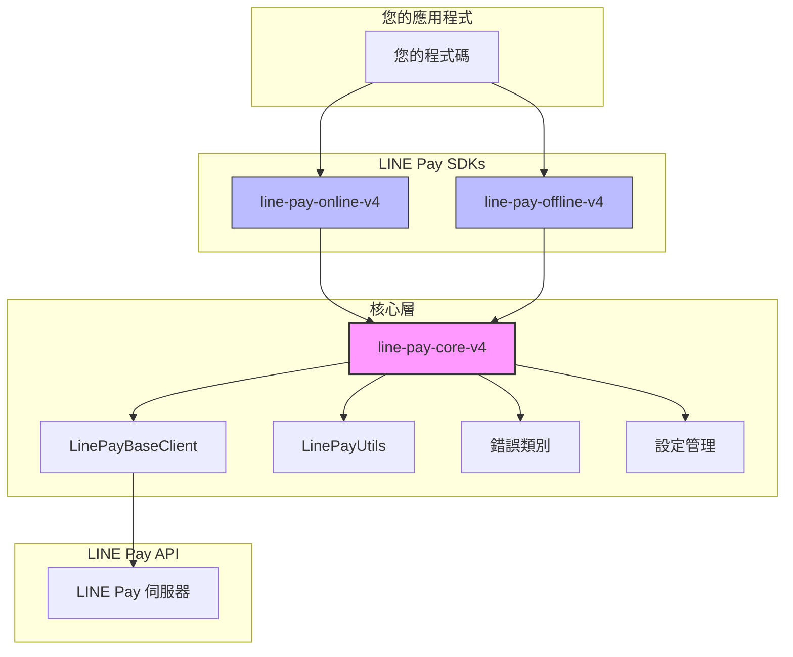

# LINE Pay Core V4 PHP

[](https://opensource.org/licenses/MIT)
[](https://www.php.net/)

**LINE Pay API V4 SDK 核心程式庫。**
提供共用的工具函式、基礎客戶端、設定和錯誤處理，為 Online 和 Offline SDK 提供動力。

**🌐 Language / 語言 / 言語 / ภาษา:**
[English](./README.md) | [繁體中文](./README_ZH.md) | [日本語](./README_JA.md) | [ภาษาไทย](./README_TH.md)

## 架構圖



## 概述

此套件是 PHP 中建構 LINE Pay V4 整合的**共用基礎**。它處理「繁重的工作」，讓 Online 和 Offline SDK 可以專注於各自的 API 邏輯。

### 核心職責

| 元件 | 功能 | 為何重要 |
|------|------|----------|
| **HMAC-SHA256 簽章** | 產生和驗證 API 簽章 | LINE Pay V4 API 最複雜的部分 — 少一個位元組請求就會失敗 |
| **HTTP 客戶端封裝** | 封裝 Guzzle 並加入重試邏輯 | 一致地處理逾時、連線錯誤和回應解析 |
| **統一錯誤解析** | 將 LINE Pay 錯誤碼解析為類型化例外 | `1xxx` = 認證, `2xxx` = 付款, `9xxx` = 內部 — 不再猜測 |
| **設定管理** | 類型安全的設定並支援環境變數 | 防止「糟糕，正式環境用錯憑證」的錯誤 |

## 需求

- PHP 8.1 或更高版本
- ext-json
- ext-openssl
- Guzzle HTTP Client 7.0+

## 安裝

```bash
composer require carllee/line-pay-core-v4
```

> ⚠️ **注意：** 這是一個**核心程式庫**，設計作為依賴套件使用。
> 
> **大多數開發者應該使用現成的 SDK：**
> - 線上付款（網頁/App 結帳）：[`carllee/line-pay-online-v4`](https://github.com/CarlLee1983/line-pay-online-v4)
> - 線下付款（POS/Kiosk）：[`carllee/line-pay-offline-v4`](https://github.com/CarlLee1983/line-pay-offline-v4-php)
>
> **只有當您需要**建構具有特殊行為的客製化 LINE Pay 客戶端時，才直接使用此套件。

## 使用方式

### 建立自訂客戶端

```php
use LinePay\Core\LinePayBaseClient;
use LinePay\Core\Config\LinePayConfig;

class MyLinePayClient extends LinePayBaseClient
{
    public function requestPayment(array $body): array
    {
        return $this->sendRequest('POST', '/v3/payments/request', $body);
    }

    public function confirmPayment(string $transactionId, array $body): array
    {
        return $this->sendRequest(
            'POST',
            "/v3/payments/{$transactionId}/confirm",
            $body
        );
    }
}

// 使用
$config = new LinePayConfig(
    channelId: getenv('LINE_PAY_CHANNEL_ID'),
    channelSecret: getenv('LINE_PAY_CHANNEL_SECRET'),
    env: 'sandbox', // 或 'production'
    timeout: 30
);

$client = new MyLinePayClient($config);
```

### 工具函式

```php
use LinePay\Core\LinePayUtils;

// 產生 API 請求簽章
$signature = LinePayUtils::generateSignature(
    $channelSecret,
    '/v3/payments/request',
    json_encode($requestBody),
    $nonce
);

// 驗證交易 ID 格式（必須是 19 位數字）
if (LinePayUtils::isValidTransactionId($transactionId)) {
    // 處理交易
}

// 解析回呼查詢參數
$result = LinePayUtils::parseConfirmQuery($_GET);
// $result['transactionId'], $result['orderId']
```

### 安全性：時序安全簽章驗證

`verifySignature` 方法使用**常數時間比較**來防止時序攻擊：

```php
use LinePay\Core\LinePayUtils;

// ✓ 安全：內部使用 hash_equals()（時序安全）
$isValid = LinePayUtils::verifySignature($secret, $data, $receivedSignature);

// ✗ 不安全：永遠不要對簽章進行直接字串比較
// $isValid = ($expectedSignature === $receivedSignature); // 容易受到時序攻擊！
```

**為何重要：** 時序攻擊可以透過測量回應時間來判斷簽章有多少字元匹配。常數時間比較無論有多少字元匹配，都會花費相同的時間。

### 錯誤處理

LINE Pay API 錯誤碼遵循一個規則：

| 錯誤碼範圍 | 類別 | 說明 |
|------------|------|------|
| `1xxx` | 認證 | Channel ID/Secret 問題、無效簽章 |
| `2xxx` | 付款 | 交易錯誤、餘額不足、已過期 |
| `9xxx` | 內部 | LINE Pay 伺服器錯誤、維護中 |

```php
use LinePay\Core\Errors\LinePayError;
use LinePay\Core\Errors\LinePayTimeoutError;
use LinePay\Core\Errors\LinePayConfigError;
use LinePay\Core\Errors\LinePayValidationError;

try {
    $response = $client->requestPayment($body);
} catch (LinePayTimeoutError $e) {
    // 處理逾時 - 重要：檢查付款狀態！
    echo "請求逾時 {$e->getTimeout()} 秒";
} catch (LinePayValidationError $e) {
    // 處理驗證錯誤（API 呼叫前）
    echo "無效輸入: {$e->getMessage()}";
} catch (LinePayError $e) {
    // 處理 API 錯誤
    echo "錯誤 [{$e->getReturnCode()}]: {$e->getReturnMessage()}";
    
    if ($e->isAuthError()) {
        // 1xxx: 檢查您的 Channel ID/Secret，或簽章產生
        error_log("認證失敗 - 驗證憑證");
    } elseif ($e->isPaymentError()) {
        // 2xxx: 交易特定問題（例如：已退款）
        notifyUser("無法處理付款");
    } elseif ($e->isInternalError()) {
        // 9xxx: LINE Pay 伺服器問題 - 以退避方式重試
        scheduleRetry($body);
    }
} catch (LinePayConfigError $e) {
    // 設定錯誤（缺少/無效憑證）
    echo "設定錯誤: {$e->getMessage()}";
}
```

## 設定

| 參數 | 類型 | 必填 | 預設值 | 說明 |
|------|------|------|--------|------|
| `channelId` | string | 是 | - | 來自 LINE Pay 商家後台的 Channel ID |
| `channelSecret` | string | 是 | - | 來自 LINE Pay 商家後台的 Channel Secret |
| `env` | string | 否 | `'sandbox'` | 環境：`'production'` 或 `'sandbox'` |
| `timeout` | int | 否 | `20` | 請求逾時秒數 |

## 相關套件

- [`carllee/line-pay-online-v4`](https://github.com/CarlLee1983/line-pay-online-v4-php) - LINE Pay Online API V4 客戶端（網頁/App 結帳）
- [`carllee/line-pay-offline-v4`](https://github.com/CarlLee1983/line-pay-offline-v4-php) - LINE Pay Offline API V4 客戶端（POS/Kiosk）

## 開發

```bash
# 安裝依賴
composer install

# 執行測試
composer test

# 執行測試並產生覆蓋率報告
composer test:coverage

# 執行靜態分析
composer analyze

# 修正程式碼風格
composer lint:fix
```

## 授權

MIT 授權 - 詳見 [LICENSE](LICENSE) 檔案。

## 作者

Carl Lee - [GitHub](https://github.com/CarlLee1983)
